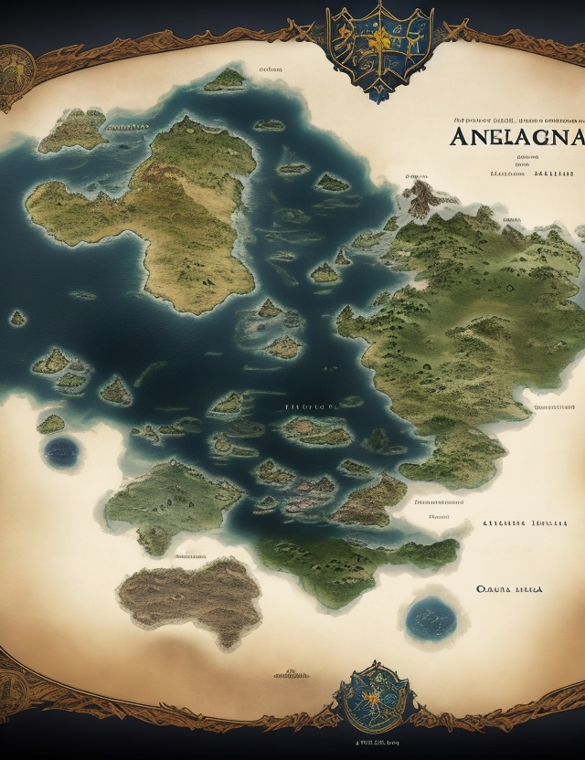

# Table of Contents

1.  [Gruppen-Mitglieder](#org93d195e)
2.  [Website](#org2bbcc2d)
    1.  [Source Code](#org6b773b6)
        1.  [XSLT](#orgd45fd7d)
        2.  [XML Datenstrukturen](#orge79be4f)
3.  [Benotung](#org1d1cecb)

# Gruppen-Mitglieder

- Jakob Fassunge
- Nils Bohland
- Margot Geisbauer
- Jan Deger
- Nick Möhrmann
- Tanina Blucha

# Website

<http://193.196.36.44/>

**Nach Hinzufügen oder löschen von Maps/Events muss die Website manuell geladen werden um Änderungen anzuzeigen**

Mit der Website sollen User die Möglichkeit haben Maps für ein DnD-Spiel anzulegen.
Dies können sie auf der rechten Seite der Website. Nachdem sie eine Map angelegt haben, wird diese mit Namen im Reiter angezeigt. Wenn sie auf den Namen einer Karte klicken, öffnet sich eine Ansicht in der Mitte des Fensters, welche die Karte mitsamt Event-Markern anzeigt. Auf der rechten Seite werden sie ein Panel zum Hinzufügen, Editieren, sowie Entfernen von Events für die aktuelle Karte finden.

Sie finden zwei Bilder welche sie als Karten verwenden können im Root Verzeichnis.

1.  
2.  

## Source Code

Wir haben uns dazu entschieden im Backend mit Spring Boot zu Arbeiten und im Frontend mit Angular. Im folgenden wollen wir ihnen unsere Projekt-Struktur erklären.

### XSLT

Wir haben uns dafür entschieden ihre Anforderungen bezüglich XSLT zu erfüllen, indem wir XSLT zum rendern der Karte mit Events verwenden.
Dazu haben wir eine Komponente geschrieben, welche das XSLT als String-literal enthält und mit Javascript in HTML transformiert. Die Komponente finden sie wie folgt:

<./angular-frontend/src/app/interactive-map/interactive-map.component.ts>

### XML Datenstrukturen

Sie können unsere XSD-Dateien wie folgt finden:

- Map.xsd : 
- Event.xsd : 

# Benotung

Tanina hat sich Webengineering bereits anrechnen lassen. Daher müssen sie keine Note für sie eintragen.
